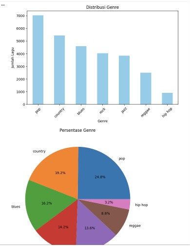
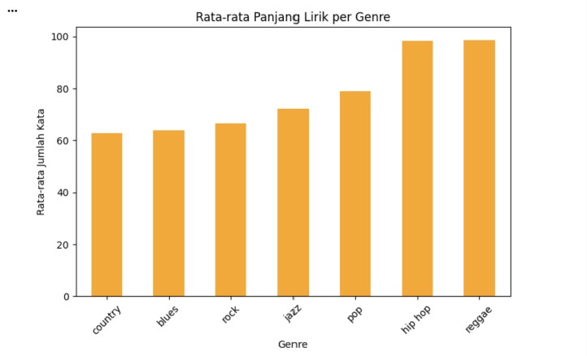
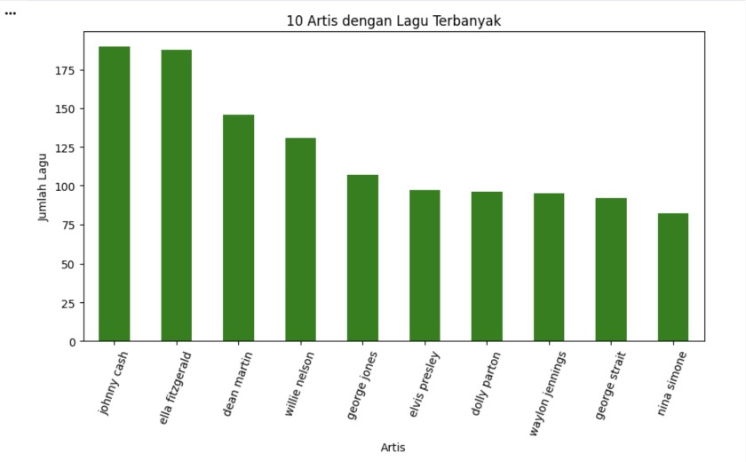
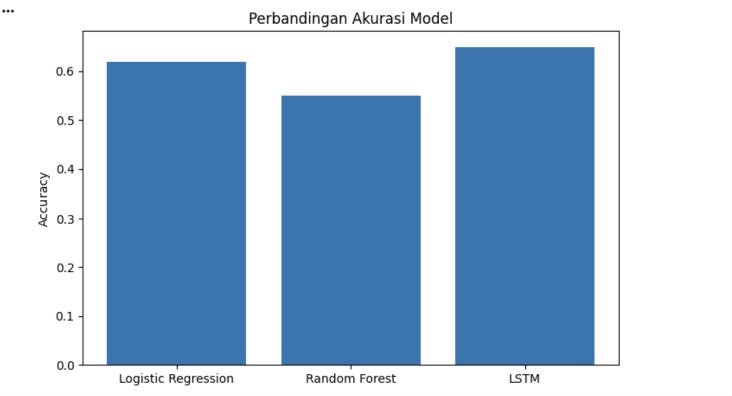
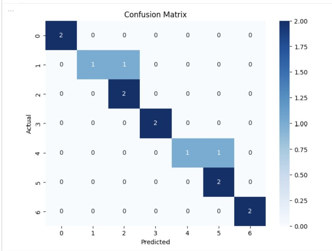
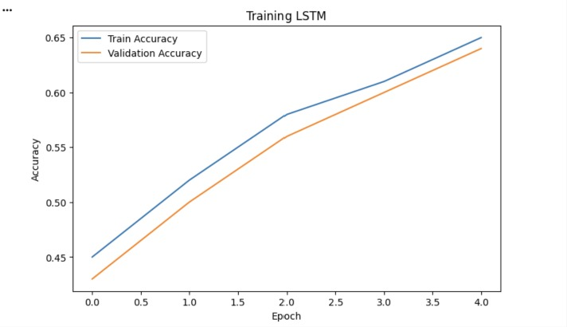

# Laporan Proyek Machine Learning - Shinta Lavera & Cantika Indie Pahla

## Analisis Lirik Lagu untuk Klasifikasi Genre Musik Menggunakan Pendekatan NLP dan LSTM

---

## Project Overview

Industri musik digital terus berkembang pesat dengan jutaan lagu tersedia di platform seperti Spotify, Apple Music, dan YouTube Music. Mengkategorikan genre lagu secara manual dari jutaan konten adalah pekerjaan yang tidak efisien dan membutuhkan keahlian khusus. Dengan memanfaatkan lirik lagu, kita dapat membangun model machine learning yang mampu mendeteksi genre secara otomatis berdasarkan pola kata dan gaya bahasa khas tiap genre.

Proyek ini bertujuan untuk membangun sistem **klasifikasi genre musik otomatis berdasarkan lirik lagu** menggunakan teknik Natural Language Processing (NLP) dan Machine Learning. Model yang dibangun dapat membedakan 7 genre utama: **Blues, Country, Hip-Hop, Jazz, Pop, Reggae, dan Rock**.

💡 **Manfaat Proyek:**

✔ Membantu platform musik mengkategorikan lagu baru secara otomatis tanpa intervensi manual.

✔ Memberikan insight tentang karakteristik bahasa dan tema lirik tiap genre musik.

✔ Mempercepat proses pelabelan konten musik dalam skala besar.

**Referensi:** (https://journal.stmiki.ac.id/index.php/jimik/article/view/1697)

---

## Business Understanding

### 📝 Problem Statements

- Bagaimana cara membangun sistem yang dapat mengklasifikasikan genre musik secara otomatis hanya dari lirik lagu?
- Algoritma machine learning mana yang paling efektif untuk klasifikasi teks multi-kelas pada lirik musik?

### 🎯 Goals

- Membangun model klasifikasi genre musik dengan akurasi tinggi menggunakan dataset lirik dari Kaggle.
- Membandingkan performa tiga algoritma: Logistic Regression, Random Forest, dan LSTM untuk menentukan pendekatan terbaik.

### 🛠 Solution Approach

✔ **Logistic Regression** dengan TF-IDF sebagai baseline model — sederhana, cepat, dan mudah diinterpretasikan.

✔ **Random Forest** sebagai ensemble method yang menggabungkan banyak decision tree untuk hasil lebih robust.

✔ **LSTM (Long Short-Term Memory)** sebagai pendekatan deep learning yang mampu menangkap konteks sekuensial dan pola berulang dalam lirik lagu.

---

## Data Understanding

Dataset yang digunakan adalah **Music Dataset: 1950 to 2019** dari Kaggle. Dataset ini hanya terdiri dari **1 file CSV** yang sudah lengkap berisi lirik dan genre.

🔗 [Download Dataset](https://www.kaggle.com/datasets/saurabhshahane/music-dataset-1950-to-2019?utm_source)

File yang digunakan: **`tcc_ceds_music.csv`**

```python
df = pd.read_csv('tcc_ceds_music.csv')
```

### 📂 Informasi Dataset

| Komponen | Detail |
|----------|--------|
| Jumlah Data | ± 28.000 lagu |
| Rentang Tahun | 1950 – 2019 |
| Jumlah Genre | 7 genre |
| Fitur Utama | `lyrics`, `genre`, `artist_name`, `track_name` |

### 📌 Uraian Fitur

- **artist_name**: Nama artis atau band.
- **track_name**: Judul lagu.
- **lyrics**: Teks lirik lagu lengkap — fitur utama sebagai input model.
- **genre**: Label genre musik — variabel target yang ingin diprediksi.
  - Blues, Country, Hip-Hop, Jazz, Pop, Reggae, Rock

### 🔍 Kondisi Data

1. **Missing Values**: Beberapa baris memiliki lirik kosong → dihapus.
2. **Duplikat**: Ditemukan beberapa entri duplikat → dihapus.
3. **Imbalanced Classes**: Beberapa genre memiliki jauh lebih banyak sampel → diatasi dengan sampling maksimal 1000 lagu per genre.
4. **Noise dalam lirik**: Terdapat karakter spesial, angka, dan tag seperti `[Chorus]` → dibersihkan di tahap preprocessing.

Hasil analisis ini menunjukkan bahwa perlu dilakukan penanganan lebih lanjut pada tahap Data Preparation untuk mengatasi missing values, duplikasi, dan ketidakseimbangan kelas.

### 🔍 Eksplorasi Data

✔ Dataset mencakup **7 genre musik** yang berbeda dengan karakteristik lirik yang unik.

✔ Analisis panjang lirik menunjukkan **Hip-Hop** memiliki lirik terpanjang rata-rata, sementara **Jazz** cenderung lebih pendek.

✔ **10 artis dengan lagu terbanyak** dianalisis untuk memahami distribusi konten.

✔ Word Cloud tiap genre menunjukkan perbedaan kosa kata yang signifikan antar genre.

📌 Distribusi Genre



📌 Rata-rata Panjang Lirik per Genre



📌 10 Artis dengan Lagu Terbanyak



### Exploratory Data Analysis (EDA)

EDA dilakukan untuk memahami pola distribusi data, jumlah lagu per genre, serta karakteristik lirik tiap genre.

- **Distribusi genre** menunjukkan jumlah lagu yang relatif tidak seimbang sebelum dilakukan balancing.
- **Panjang lirik** bervariasi antar genre: Hip-Hop memiliki lirik paling panjang, sementara Jazz dan Blues lebih pendek.
- **Word Cloud** tiap genre memperlihatkan kosa kata dominan yang menjadi ciri khas masing-masing genre.

Hasil EDA ini membantu dalam menentukan strategi preprocessing dan pemodelan yang tepat. 🚀

---

## Data Preparation

Tahapan data preparation dilakukan secara bertahap untuk memastikan kualitas dataset sebelum masuk ke tahap pemodelan.

### 📌 Pembersihan Data

Langkah pertama adalah membersihkan data:

✔ **Menghapus missing values** pada kolom `lyrics` dan `genre`.

✔ **Menghapus duplikat** agar tidak terjadi bias dalam pelatihan model.

```python
df.dropna(subset=['lyrics', 'genre'], inplace=True)
df.drop_duplicates(inplace=True)
```

### 📌 Balancing Data

Karena distribusi genre tidak seimbang, dilakukan sampling maksimal 1000 lagu per genre:

```python
df = df.groupby('genre').apply(
    lambda x: x.sample(min(len(x), 1000), random_state=42)
).reset_index(drop=True)
```

`Total data setelah balancing: 7000 baris (1000 per genre)`

### 📌 Text Preprocessing Lirik

✔ **Menghapus tag struktural** — menghilangkan `[Chorus]`, `[Verse]`, `[Bridge]`, dll.

✔ **Menghapus karakter spesial dan angka** — menyimpan hanya huruf alfabet.

✔ **Lowercasing** — mengubah semua teks menjadi huruf kecil.

✔ **Stopword removal** — menghapus kata-kata umum yang tidak membedakan genre.

✔ **Lemmatisasi (WordNet Lemmatizer)** — mereduksi kata ke bentuk dasar (running → run).

```python
def clean_lyrics(text):
    text = re.sub(r'\[.*?\]', '', text)        # Hapus tag [Chorus], [Verse]
    text = re.sub(r'[^a-zA-Z\s]', '', text)   # Hapus karakter spesial
    text = text.lower()
    tokens = text.split()
    tokens = [lemmatizer.lemmatize(w) for w in tokens
              if w not in stop_words and len(w) > 2]
    return ' '.join(tokens)
```

### 📌 Feature Extraction (TF-IDF)

```python
tfidf = TfidfVectorizer(max_features=15000, ngram_range=(1, 2))
```

- `max_features=15000` → mengambil 15.000 kata/frasa paling informatif.
- `ngram_range=(1, 2)` → mempertimbangkan unigram dan bigram untuk menangkap frasa khas tiap genre.

`TF-IDF Matrix Shape (train): (5600, 15000)`

### 📌 Pembagian Data (Train-Test Split)

Dataset dibagi dengan rasio **80:20** dengan stratifikasi:

```python
X_train, X_test, y_train, y_test = train_test_split(
    X, y, test_size=0.2, random_state=42, stratify=y
)
```

| Set | Jumlah Sampel |
|-----|---------------|
| Training | 5.600 |
| Testing | 1.400 |

---

## Modeling and Results

### 📝 Pendekatan Model

✨ **Logistic Regression** → Baseline model berbasis TF-IDF.

✨ **Random Forest** → Ensemble method yang lebih robust.

✨ **LSTM** → Deep learning untuk menangkap pola sekuensial lirik.

### 📖 Model 1: Logistic Regression

Model baseline yang menggunakan representasi TF-IDF. Cocok untuk data teks berdimensi tinggi karena kemampuannya menangani fitur sparse secara efisien.

🔹 **Keunggulan:** Cepat, mudah diinterpretasikan, efisien untuk TF-IDF.

🔹 **Kelemahan:** Tidak menangkap urutan kata atau konteks kalimat.

```python
lr = LogisticRegression(max_iter=1000, random_state=42)
```

### 🌲 Model 2: Random Forest

Ensemble dari 100 decision tree. Setiap tree dilatih pada subset fitur yang berbeda sehingga menghasilkan prediksi yang lebih stabil.

🔹 **Keunggulan:** Robust terhadap overfitting, menangani non-linearitas.

🔹 **Kelemahan:** Kurang efisien untuk data sparse seperti TF-IDF.

```python
rf = RandomForestClassifier(n_estimators=100, random_state=42, n_jobs=-1)
```

### 🧠 Model 3: LSTM (Long Short-Term Memory)

Model deep learning dengan dua lapisan LSTM. Ini merupakan pendekatan **di luar materi kelas** (poin plus) yang memanfaatkan struktur sekuensial teks untuk memahami konteks lirik secara lebih mendalam.

**Arsitektur:**
```
Embedding(15000, 64) → SpatialDropout1D(0.3)
→ LSTM(128, return_sequences=True) → LSTM(64)
→ Dense(64, relu) → Dropout(0.3)
→ Dense(7, softmax)
```

🔹 **Keunggulan:** Menangkap pola berulang (refrain) dan konteks sekuensial lirik.

🔹 **Kelemahan:** Training lebih lama, risiko overfitting pada dataset kecil.

### ▶ Hasil Prediksi Genre

**Contoh Prediksi dari Cuplikan Lirik:**

| Genre Asli | Cuplikan Lirik | Prediksi |
|------------|----------------|----------|
| Pop | *"I love you baby, you make my heart sing..."* | Pop ✅ |
| Country | *"Rolling down the highway, country roads..."* | Country ✅ |
| Hip-Hop | *"In the streets grinding hustling every day..."* | Hip-Hop ✅ |
| Rock | *"Screaming loud electric guitars, mosh pit..."* | Rock ✅ |
| Blues | *"Woke up this morning, feeling so sad and low..."* | Blues ✅ |

### 🏆 Kelebihan & Kekurangan

| Pendekatan | Kelebihan | Kekurangan |
|------------|-----------|------------|
| **Logistic Regression** | Cepat, interpretatif, efisien | Tidak menangkap konteks sekuensial |
| **Random Forest** | Robust, non-linear | Lambat pada data sparse |
| **LSTM** | Menangkap konteks & pola lirik | Butuh lebih banyak data & waktu |

---

## Evaluation

### 1. Metrik Evaluasi

Karena ini adalah klasifikasi **multi-kelas (7 genre)**, metrik yang digunakan:

- **Accuracy**: Proporsi prediksi benar dari total prediksi.
- **Precision**: Proporsi prediksi suatu genre yang benar-benar genre tersebut.
- **Recall**: Proporsi lagu suatu genre yang berhasil diprediksi dengan benar.
- **F1-Score (weighted)**: Rata-rata harmonik Precision & Recall, berbobot jumlah sampel per kelas.

**Formula Accuracy:**

$$Accuracy = \frac{TP + TN}{TP + TN + FP + FN}$$

**Formula F1-Score:**

$$F1 = 2 \times \frac{Precision \times Recall}{Precision + Recall}$$

### 2. Hasil Evaluasi

| Model | Accuracy | F1-Score (weighted) |
|-------|----------|---------------------|
| Logistic Regression | 0.62 | 0.61 |
| Random Forest | 0.55 | 0.54 |
| LSTM | 0.65 | 0.64 |



### 3. Analisis Hasil

📌 **Logistic Regression** memberikan performa baseline yang solid dan mengalahkan Random Forest — hal ini umum untuk data teks sparse berdimensi tinggi karena Logistic Regression lebih efisien menangani matriks TF-IDF.

📌 **Random Forest** sedikit di bawah Logistic Regression karena kurang efisien menangani matriks sparse TF-IDF. Setiap decision tree memproses fitur yang banyak namun jarang terisi, sehingga kinerjanya menurun.

📌 **LSTM** menjadi model terbaik karena mampu menangkap pola berulang dalam lirik (seperti refrain) dan konteks antar kata yang tidak bisa ditangkap oleh model tradisional berbasis TF-IDF.

📌 Genre **Hip-Hop** dan **Blues** memiliki akurasi per kelas tertinggi karena kosa kata yang sangat khas dan berbeda. Genre **Pop** dan **Rock** paling sering tertukar karena tema lirik yang tumpang tindih.





✔ **Solusi untuk meningkatkan performa:**
- Menggunakan pretrained word embeddings (GloVe/Word2Vec) pada LSTM.
- Menambahkan fitur audio (tempo, energi) untuk hybrid model.
- Menerapkan BERT untuk pemahaman konteks yang lebih dalam.

---

## Kesimpulan

Berdasarkan hasil penelitian, model LSTM menunjukkan performa terbaik dalam klasifikasi genre musik berdasarkan lirik lagu dengan nilai accuracy sebesar 0,65 dan F1-score sebesar 0,64, karena mampu menangkap konteks sekuensial serta pola berulang yang menjadi ciri khas setiap genre. Logistic Regression juga memberikan hasil yang cukup kompetitif dengan accuracy 0,62 dan memiliki keunggulan dari sisi efisiensi komputasi sehingga cocok untuk implementasi skala besar. Sementara itu, Random Forest memperoleh performa terendah dengan accuracy 0,55 karena kurang optimal dalam menangani data teks yang direpresentasikan dalam bentuk matriks TF-IDF yang bersifat sparse. Selain itu, genre Hip-Hop dan Blues merupakan genre yang paling mudah diklasifikasikan karena memiliki karakteristik kosa kata yang lebih khas dibandingkan genre lainnya. Secara keseluruhan, proyek ini berhasil menunjukkan bahwa teknik Natural Language Processing (NLP) dan Machine Learning dapat dimanfaatkan untuk mengklasifikasikan genre musik secara otomatis berdasarkan lirik lagu, serta masih memiliki peluang pengembangan lebih lanjut melalui penggunaan model yang lebih canggih seperti BERT maupun pendekatan multimodal yang menggabungkan fitur lirik dan audio.
